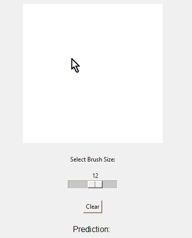
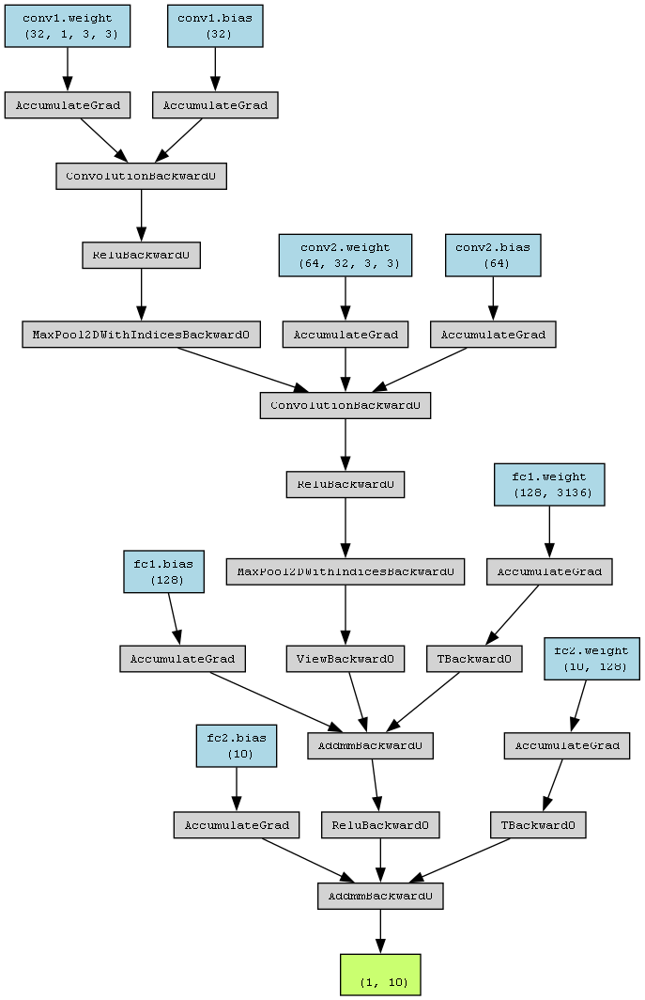

# Interactive digit classifier

I trained a CNN digit classifier on MNIST dataset using PyTorch with 98% accuracy.

But to make it more fun, you can also draw a digit on the canvas and the classifier will predict the digit on the fly.

The model's checkpoint is 2.2MB (estimated, 5MB actual on disk) and is included in this repo. The parameter count is 421k.

## How to use

Run `load_model.ipynb` notebook to load and run the model. I will open the canvas for you to draw a digit.
